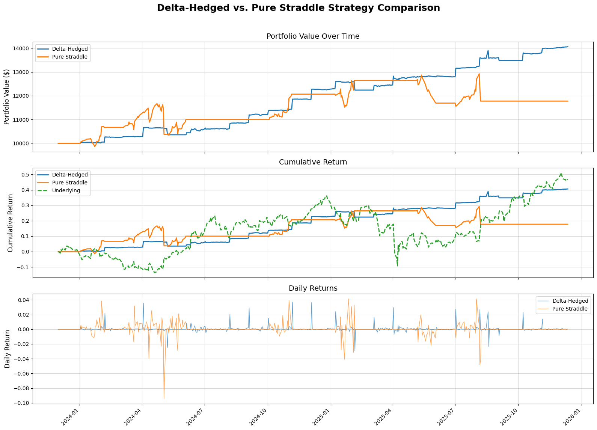
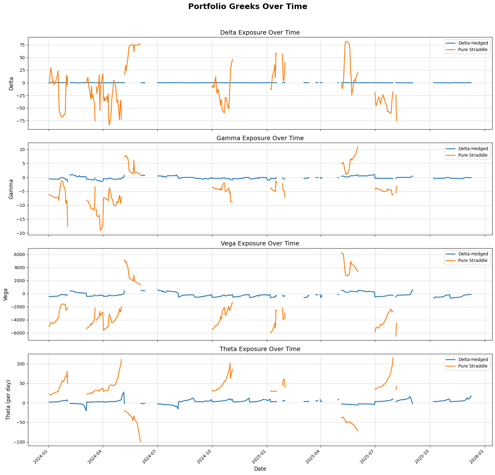

# Volatility-Based Quantitative Trading Strategy

A quantitative trading strategy that exploits the volatility risk premium (VRP) by trading straddles based on the relationship between implied volatility (IV) and realized volatility (RV). The strategy includes both delta-hedged and unhedged implementations for performance comparison.

## Overview

This project implements a volatility trading strategy that:
- **Shorts straddles** when Implied Volatility (IV) > Realized Volatility (RV) - betting that IV is overpriced
- **Longs straddles** when IV < RV - betting that IV is underpriced
- Compares **delta-hedged** vs **unhedged** strategies to demonstrate the impact of delta hedging on risk management

The backtest results demonstrate the superior risk-adjusted performance of the delta-hedged strategy:

| Strategy | Sharpe Ratio | Annual Return | Annual Volatility |
|----------|--------------|---------------|-------------------|
| **Delta-Hedged** | 2.14 | 17.1537% | 8.03% |
| **Pure Straddle** | 0.65 |  9.0516%  |13.92% |

### Performance Visualization

The backtest results demonstrate the comparative performance of delta-hedged and unhedged strategies:


*Portfolio value evolution and cumulative returns comparison between delta-hedged and unhedged strategies. The chart shows how delta hedging affects portfolio performance, volatility, and risk-adjusted returns over the backtest period.*


*Portfolio Greeks (Delta, Gamma, Vega, Theta) exposure over time for both strategies. This visualization highlights how delta hedging maintains near-zero delta exposure while the unhedged strategy retains directional risk. The charts also show vega and theta exposure, which are key drivers of volatility trading profitability.*

### Risk-Return Metrics
**Key Findings:**
- **Delta-Hedged Strategy**: Achieves a Sharpe Ratio of 2.14 with annual volatility of 8.03%, demonstrating excellent risk-adjusted returns
- **Pure Straddle Strategy**: Shows a lower Sharpe Ratio of 0.65 with higher volatility of 13.92%, indicating greater risk exposure
- **Delta Hedging Benefit**: The delta-hedged approach significantly reduces volatility (8.03% vs 13.92%) while maintaining superior risk-adjusted returns, highlighting the effectiveness of delta hedging in managing directional risk

## Strategy Logic

### Core Concept
The strategy is based on the volatility risk premium (VRP), which is the difference between implied and realized volatility:
- **VRP = IV - RV**
- When VRP > threshold: Short straddle (sell options, collect premium)
- When VRP < -threshold: Long straddle (buy options, pay premium)

### Delta Hedging
- **Delta-Hedged Strategy (`Agent_DDH`)**: Actively hedges delta exposure by trading the underlying asset to maintain delta neutrality
- **Unhedged Strategy (`Agent_Straddles`)**: Maintains pure option positions without delta hedging

### Capital Allocation

The strategy uses a **vega-based position sizing** approach to allocate capital dynamically based on the total account value:

#### Vega-Based Sizing Formula
```
Target Vega = Total Account Value × Vega Risk Fraction
Number of Contracts = Target Vega / Per-Contract Vega
```

#### Key Components:
- **Total Account Value (NAV)**: The current net asset value of the portfolio, including:
  - Cash balance
  - Option positions (marked-to-market)
  - Underlying asset positions (for delta-hedged strategy)

- **Vega Risk Fraction**: A configurable parameter (typically 0.1 to 1.0) that determines what percentage of total account value should be allocated to vega risk
  - Example: If NAV = $10,000 and vega_risk_frac = 0.5, then target vega = $5,000

- **Per-Contract Vega**: The vega exposure of a single straddle contract, calculated using Black-Scholes Greeks

#### Benefits of Vega-Based Allocation:
1. **Risk Scaling**: Position sizes automatically scale with account growth or decline
2. **Volatility Targeting**: Maintains consistent volatility exposure relative to portfolio size
3. **Capital Efficiency**: Allocates capital based on the primary risk factor (volatility) rather than premium paid
4. **Dynamic Adjustment**: As account value changes, new positions are sized proportionally

#### Example:
- Account Value: $10,000
- Vega Risk Fraction: 50% (0.5)
- Target Vega: $5,000
- Per-Contract Vega: $250
- **Result**: Trade 20 contracts ($5,000 / $250 = 20)

This approach ensures that the strategy maintains consistent risk exposure relative to portfolio size, allowing for proper compounding and risk management as the account grows or shrinks.

## Project Structure

```
Volatility-based_Quant_Strategy/
├── Agent_Class.py              # Unhedged straddle strategy implementation
├── Agent_DDH_Class.py          # Delta-hedged straddle strategy implementation
├── Build_date.ipynb            # Data collection and preprocessing notebook
├── Back_test.ipynb             # Backtesting and performance analysis notebook
├── data/                       # Market data files
│   ├── underlying.csv          # Historical underlying asset prices
│   └── ...
├── DataSet/                    # Processed option data
│   ├── call_list.pkl          # List of call option symbols
│   ├── put_list.pkl           # List of put option symbols
│   ├── dates.pkl              # Trading dates
│   ├── date_strs.pkl          # Trading dates (string format)
│   └── O_*.csv                # Individual option contract data
└── demo/                       # Visualization outputs
```

## Key Components

### 1. Data Collection (`Build_date.ipynb`)

- Downloads historical price data for the underlying asset (AAPL)
- Calculates 20-day rolling realized volatility (RV)
- Identifies trading dates (first Tuesday of each month)
- Selects at-the-money (ATM) options expiring on the second Friday of the next month
- Downloads option price data and calculates implied volatility using Black-Scholes
- Stores all data in pickle files for efficient backtesting

### 2. Strategy Agents

#### `Agent_Straddles` (Unhedged)
- Pure straddle strategy without delta hedging
- Position sizing based on vega risk or premium risk
- Tracks portfolio Greeks (Delta, Gamma, Vega, Theta)
- Exit conditions: stop-loss, time-to-maturity limits

#### `Agent_DDH` (Delta-Hedged)
- Straddle strategy with dynamic delta hedging
- Rehedges periodically to maintain delta neutrality
- Reduces directional risk exposure
- Same entry/exit logic as unhedged strategy

### 3. Backtesting (`Back_test.ipynb`)

- Runs parallel backtests for both strategies
- Tracks daily NAV, Greeks, and trade events
- Computes performance metrics:
  - Sharpe Ratio
  - Annual Volatility
  - Maximum Drawdown
  - Total Return
- Generates comparative visualizations

## Features

### Position Sizing
- **Vega-based sizing**: Allocates capital based on vega exposure
- **Premium-based sizing**: Fallback method using option premium
- Configurable risk limits and maximum position sizes

### Risk Management
- **Stop-loss**: Exits positions when losses exceed threshold
- **Time-to-maturity limits**: Closes positions near expiration
- **Delta drift monitoring**: Rehedges when delta deviates significantly
- **Transaction costs**: Configurable trading costs

### Greeks Tracking
- **Delta**: Price sensitivity to underlying moves
- **Gamma**: Rate of change of delta
- **Vega**: Sensitivity to volatility changes
- **Theta**: Time decay

## Usage

### 1. Data Preparation

Run `Build_date.ipynb` to:
- Download underlying asset data
- Calculate realized volatility
- Download and process option data
- Generate trading date lists

### 2. Backtesting

Run `Back_test.ipynb` to:
- Initialize both strategy agents
- Run backtest loop over historical period
- Generate performance metrics and visualizations
- Compare delta-hedged vs unhedged strategies

### Configuration Parameters

#### Delta-Hedged Agent (`Agent_DDH`)
```python
agent_ddh = Agent_DDH(
    balance=10000.0,              # Initial capital
    vega_risk_frac=1.0,           # Vega risk as % of NAV
    max_vega_per_trade=5000,      # Maximum vega per trade
    vrp_threshold=0.0005,         # VRP threshold for trading
    max_leverage=20,              # Maximum leverage
    tx_cost=0,                    # Transaction cost (0-1)
    rehedge_freq=1000,            # Rehedging frequency (days)
    delta_drift_threshold=0.05,   # Delta drift threshold
    stop_loss_frac=0.5,           # Stop-loss fraction
)
```

#### Unhedged Agent (`Agent_Straddles`)
```python
agent_straddle = Agent_Straddles(
    balance=10000.0,              # Initial capital
    sizing_method='vega',         # 'vega' or 'premium'
    vega_risk_frac=0.5,           # Vega risk as % of NAV
    premium_risk_frac=1.0,        # Premium risk as % of NAV
    max_units=500000,             # Maximum contracts per trade
    vrp_threshold=0.05,           # VRP threshold for trading
    tx_cost=0,                    # Transaction cost
    stop_loss_frac=0.5,           # Stop-loss fraction
)
```

## Performance Metrics

The backtest generates comprehensive performance metrics:

- **Final NAV**: Ending portfolio value
- **Total Return**: Cumulative return over backtest period
- **Sharpe Ratio**: Risk-adjusted return measure
- **Annual Volatility**: Standard deviation of returns (annualized)
- **Maximum Drawdown**: Largest peak-to-trough decline

## Dependencies

```python
pandas
numpy
scipy
matplotlib
yfinance
polygon-api-client
```

## Data Requirements

- Underlying asset historical prices (AAPL in current implementation)
- Option contract data with:
  - Strike prices
  - Expiration dates
  - Daily OHLCV data
  - Implied volatility (calculated or provided)

## Notes

- The strategy uses Black-Scholes model for Greeks calculation
- Implied volatility is calculated using Brent's method
- Realized volatility is calculated using 20-day rolling window
- Trading occurs on the first Tuesday of each month
- Options selected are ATM with expiration on second Friday of next month

