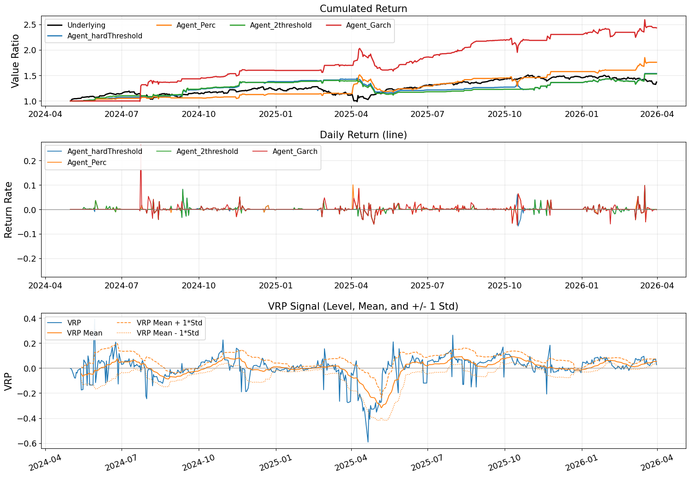
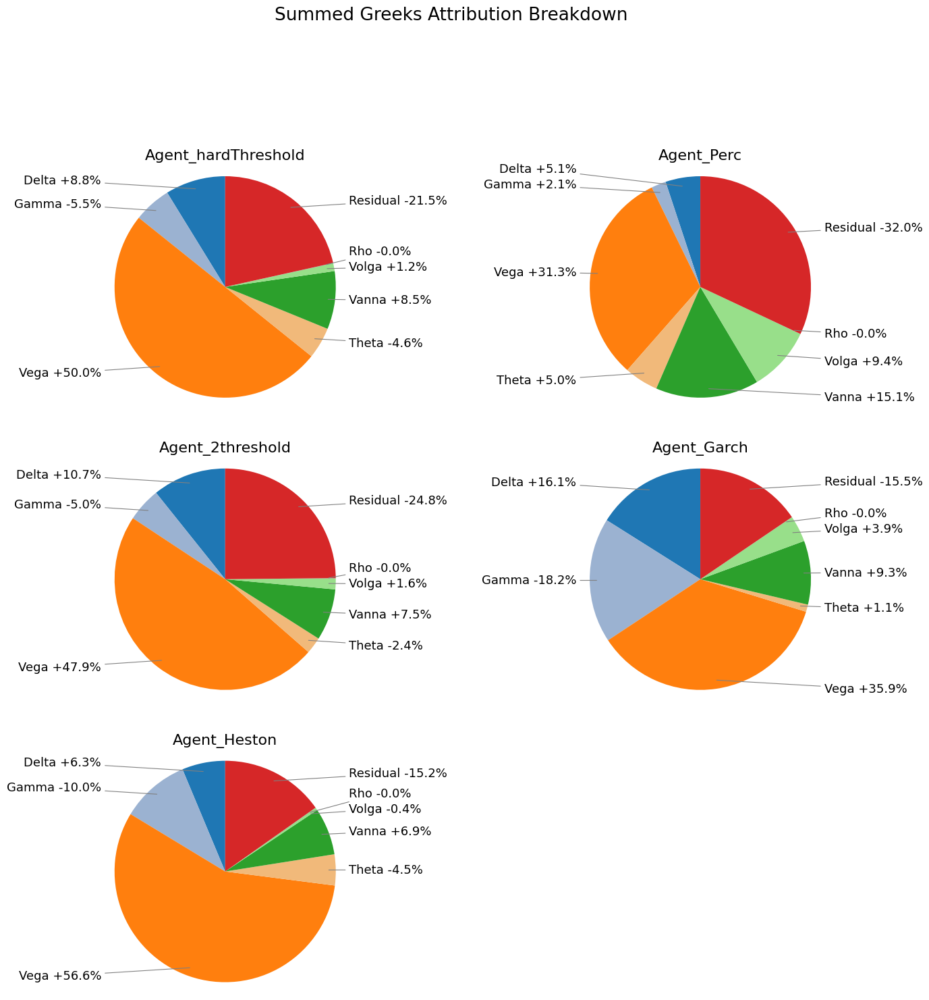
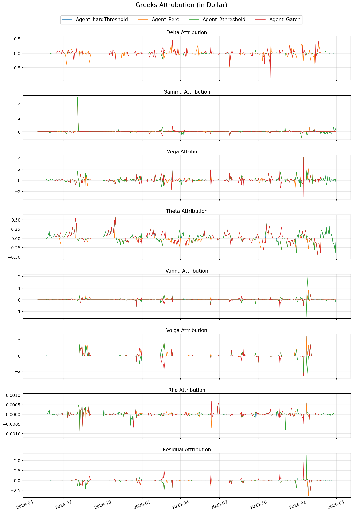

# Volatility-based Quant Strategy

*Documentation last aligned with the repository: **May 2026**.*

This repository implements a low-frequency volatility timing quantitative strategy. The strategy aims to capture the Volatility Risk Premium (VRP) and mean-reverting properties of implied volatility by actively trading at-the-money (ATM) ~30-day straddles.

## Overall Strategy Idea

The core concept relies on the spread between Implied Volatility (IV) and Realized Volatility (RV). When options are "overpriced" (IV is significantly higher than RV or its historical mean), the strategy sells volatility (short straddle). When options are "underpriced" (IV is unusually low), the strategy buys volatility (long straddle). 

During the holding period, the strategy dynamically hedges its directional exposure (Delta hedging) based on a defined threshold to ensure the returns are primarily driven by Vega, Gamma, and Theta, rather than the underlying asset's price movement. The framework calculates daily mark-to-market PnL, geometric log-returns, and uses path-wise Greeks attribution for daily PnL decomposition.

### Annualization & Day-Count Convention

All calculations use **252 trading days per year** consistently

## Strategy Agents

The codebase supports multiple signal-generating agents that can be run concurrently in a backtest. Each agent shares the same execution, PnL, and Greek attribution framework but uses distinct entry/exit logic.

### Shared Parameters

All agents accept these parameters:

| Parameter | Description | Default |
| :--- | :--- | :--- |
| `display_name` | Label used in plots and stats tables | agent-specific |
| `allow_short` | Whether the agent can sell straddles | `True` |
| `delta_hedge` | Whether to delta-hedge positions | `True` |
| `long_rehedge_threshold` | Multiplier `k` for long straddle rehedge band `k * sqrt(2 * |theta| * gamma / 252)` — `Straddle_Theta` is per year of \(T\); `/252` is one trading day of decay (same convention as PnL `dt`) | `1.5` |
| `short_rehedge_threshold` | Same multiplier for short straddle positions | `0.5` |
| `kde_rolling_window` | Number of days used to fit the rolling KDE distribution for signal generation | `63` |
| `ewma_lambda` | Decay factor for the EWMA variance model (applicable to `Agent_EWMA` and `Agent_Vote`) | `0.94` |

The rehedge band is **derived from the gamma–theta breakeven idea** (convexity vs time decay): over a short horizon, half the dollar gamma times the squared move competes with theta carry; tying a characteristic move scale to **current** straddle theta and gamma is the same “where does convexity offset decay?” logic. The implementation uses `k * sqrt(2 * |theta| * gamma / 252)` with separate `k` for long vs short.

### Shared Execution Rules

- **Position unit**: each options trade is **1 lot = 100 options**
- **Underlying hedge**: hedge shares are always rounded to an **integer**
- **Re-hedge PnL**: realized using hedge average entry vs exit price on underlying reductions/flips

### What “KDE-CDF Signal” means

Let **something** be **IV − EWMA(RV)** (EWMA), **IV − long-term RV** (LongTerm), or **VRP**, with **IV** = `Straddle_imp_vol`, **EWMA(RV)** from the model, and **long-term RV** = mean of the prior `long_term_window` daily **RV** values (today’s **RV** is not in **long-term RV** for that day).

**KDE-CDF Signal(something)** = `2 * CDF(something | KDE of past kde_rolling_window days) - 1`. This transforms the rolling distribution value into a bounded `[-1, 1]` range.

**Entries:** long when **KDE-CDF < −entry_threshold**; short when **KDE-CDF > +entry_threshold** if `allow_short`. **Exits:** when **KDE-CDF** crosses **0** (long at **≥ 0**, short at **≤ 0** in code).

The KDE-CDF perfectly bounds the signal to `[-1, 1]`, filtering out noise in low-density regions and providing robust, outlier-resistant entry signals without the extreme fluctuations seen in traditional Z-scores. The `kde_rolling_window` parameter (default 63) controls the memory length of the distribution.

### Signal Logic (summary table)

| Agent | Long (Buy Vol) | Short (Sell Vol) | Close (Exit) |
| :--- | :--- | :--- | :--- |
| **`Agent_RV`** | **KDE-CDF(VRP) < −entry_threshold** | **KDE-CDF(VRP) > +entry_threshold** if `allow_short` | **KDE-CDF(VRP)** crosses **0** |
| **`Agent_EWMA`** | **KDE-CDF(IV − EWMA(RV)) < −entry_threshold** | **KDE-CDF(IV − EWMA(RV)) > +entry_threshold** if `allow_short` | KDE-CDF **crosses 0** |
| **`Agent_LongTerm`** | **KDE-CDF(IV − long-term RV) < −entry_threshold** | **KDE-CDF(IV − long-term RV) > +entry_threshold** if `allow_short` | KDE-CDF **crosses 0** |

### Agent_EWMA Details

This agent operates identically to `Agent_RV`, but simply replaces the standard trailing **RV** with an **Exponentially Weighted Moving Average of RV (EWMA(RV))**. The decay factor is controlled by the `ewma_lambda` parameter.

### Agent_LongTerm Details

This agent operates identically to `Agent_RV`, but replaces the standard trailing **RV** with a longer-term moving average of **RV**. The length of this moving average is controlled by the `long_term_window` parameter.

### Agent_Vote Details

This agent combines the signals from `Agent_RV`, `Agent_EWMA`, and `Agent_LongTerm` using an equal-weight voting mechanism. Each sub-component independently votes to go long (+1), short (-1), or stay flat (0). The agent executes a trade if the total sum of the votes is **≥ 1** (Long) or **≤ -1** (Short), otherwise it remains flat.

---

## Data Pipeline (`Build_data.ipynb`)

Builds a single CSV per symbol at `DataSet/{symbol}.csv`:

1. Downloads daily equity data from **yfinance** (close, dividends, returns, 20-day RV)
2. Fetches the 1-month Treasury yield from **Polygon** as the risk-free rate
3. For each month, selects the ATM straddle (next-month expiry) via **Polygon** options chain
4. Retrieves daily option bars, computes Black-Scholes implied vol (Polygon IV when available, `brentq` inversion otherwise)
5. Computes straddle implied vol (bisection so BS\_straddle(sigma) = market\_price), VRP = IV - RV
6. Computes per-leg and straddle Greeks (Delta, Gamma, Vega, Theta, Rho, Vanna, Volga)

### Key Column Definitions

Each row is **one equity session** in the monthly **ATM straddle** panel (`Build_data.ipynb` writes columns in this order). Short labels below; full construction is in that notebook.

| Column | Description |
| :--- | :--- |
| `Date` | Session date. |
| `Stock_Close` | Underlying close **S** (decimal price). |
| `Stock_Dividends` | Cash dividend that day (**0** if none). |
| `r` | Annual risk-free rate, **decimal** (e.g. 1m Treasury aligned to `Date`). |
| `RV` | Trailing **realized** vol, annualized decimal (from return history; NaN until enough days). Feeds **long-term RV** in LongTerm. |
| `K` | Strike **K** of the month’s ATM straddle. |
| `Expiry` | Listed expiry of the options (used e.g. for **EWMA** horizon to expiry). |
| `Call_Close` / `Put_Close` | Call / put **close** (straddle premium = sum). |
| `Call_Sym` / `Put_Sym` | Polygon OCC-style identifiers for the legs. |
| `Call_imp_vol` / `Put_imp_vol` | Leg implied vol **σ**, decimal (chain IV or BS inversion). |
| `Straddle_imp_vol` | Single **σ** such that BS straddle price matches **Call_Close + Put_Close** (bisection). |
| `VRP` | **Straddle_imp_vol − RV** (vol risk premium, decimal). |
| `Straddle_Delta` | **Call_Delta + Put_Delta** (long one call + one put at each leg’s σ). |
| `Straddle_Gamma` | **Call_Gamma + Put_Gamma**. |
| `Straddle_Vega` | **Call_Vega + Put_Vega**. |
| `Straddle_Theta` | **Call_Theta + Put_Theta** (time decay; convention matches `Build_data.ipynb`). |
| `Straddle_Rho` | **Call_Rho + Put_Rho** (sensitivity to **r**; **Rho** columns are per **+1 percentage point** in **r**). |
| `Straddle_Vanna` | **Call_Vanna + Put_Vanna**. |
| `Straddle_Volga` | **Call_Volga + Put_Volga**. |
| `Call_Delta`, `Call_Gamma`, `Call_Vega`, `Call_Theta`, `Call_Rho`, `Call_Vanna`, `Call_Volga` | BS Greeks for the **call** at **Call_imp_vol** / **K** / **Expiry** / **r** / **S**. |
| `Put_Delta`, `Put_Gamma`, `Put_Vega`, `Put_Theta`, `Put_Rho`, `Put_Vanna`, `Put_Volga` | BS Greeks for the **put** at **Put_imp_vol** / same **K**, **Expiry**, **r**, **S**. |
| `Force_Close` | **`True`** on the **last** session kept for that month (agents flatten); **`False`** otherwise. |

---

## Backtest (`Back_test.ipynb`)

1. Load a dataset CSV
2. Instantiate agents with desired parameters
3. Loop through each row calling `agent.trade(row)`
4. Generate performance stats and visualizations

### Backtest Snapshot

Illustrative run from `Back_test.ipynb` (metrics change with data and parameters):

- Dataset: `DataSet/SPY.csv`
- Shared: `delta_hedge=True`, `long_rehedge_threshold=1.2`, `short_rehedge_threshold=0.8`
- Agents configured:
  - `Agent_RV`: `entry_threshold=0.8`, `kde_rolling_window=63`
  - `Agent_EWMA`: `entry_threshold=0.8`, `kde_rolling_window=63`, `ewma_lambda=0.8`
  - `Agent_LongTerm`: `entry_threshold=0.8`, `kde_rolling_window=63`, `long_term_window=60`
  - `Agent_Vote`: `entry_threshold=0.8`, `kde_rolling_window=63`, `ewma_lambda=0.8`, `long_term_window=60`

**Strategy statistics** (same run, results from **SPY**):

| Agent | Win Rate | Sharpe Ratio | Sortino Ratio | Annual Return | Annual Volatility | Max Drawdown | Calmar Ratio | Kelly's Criteria |
| :--- | ---: | ---: | ---: | ---: | ---: | ---: | ---: | ---: |
| `Agent_RV` | 76.92% | 1.5174 | 1.6838 | 26.84% | 15.67% | -11.48% | 2.3387 | 9.6841 |
| `Agent_EWMA` | 75.00% | 1.0104 | 0.8521 | 18.91% | 17.14% | -15.53% | 1.2177 | 5.8948 |
| `Agent_LongTerm` | 71.43% | 1.1208 | 1.0838 | 25.40% | 20.20% | -11.12% | 2.2839 | 5.5496 |
| `Agent_Vote` | 77.55% | 1.8084 | 1.9830 | 41.64% | 19.25% | -8.69% | 4.7911 | 9.3933 |

## Greeks Attribution Calculation

The project uses **path-wise daily attribution** with **timestep Greeks** (Greeks at time `t` explain PnL from `t -> t+1`).

Let:
- `q_t`: option lots (`+1` long straddle lot, `-1` short straddle lot)
- `L`: lot size (`L = 100` options per lot)
- `h_t`: hedge shares held before move
- `dS = S_{t+1} - S_t`
- `dS_adj = dS + dividends`
- `dσ = σ_{t+1} - σ_t` where `σ` is `Straddle_imp_vol`
- `dr = r_{t+1} - r_t`
- `dt = busday_count(t, t+1) / 252`

Daily PnL decomposition:

- **Delta attribution**
  - `Delta_t = (q_t * L) * Delta_eff_t * dS`
  - where `Delta_eff_t = Straddle_Delta_t` normally, and on re-hedge-trigger days uses midpoint delta `0.5*(Delta_t_prev + Delta_t_curr)` to reduce residual leakage
- **Gamma attribution (hedge merged in)**
  - `Gamma_t = (q_t * L) * 0.5 * Straddle_Gamma_t * dS^2 + h_t * dS_adj`
  - Note: hedge PnL is merged into `gamma_attribute`.
- **Vega attribution**
  - `Vega_t = (q_t * L) * Straddle_Vega_t * dσ`
- **Vanna attribution**
  - `Vanna_t = (q_t * L) * Straddle_Vanna_t * dS * dσ`
- **Volga attribution**
  - `Volga_t = (q_t * L) * 0.5 * Straddle_Volga_t * dσ^2`
- **Theta attribution**
  - `Theta_t = (q_t * L) * Straddle_Theta_t * dt`
- **Rho attribution**
  - `Rho_t = (q_t * L) * Straddle_Rho_t * dr * 100`
  - (`Straddle_Rho` is stored per +1 percentage-point rate change.)
- **Residual**
  - `Residual_t = TotalPnL_t - (Delta_t + Gamma_t + Vega_t + Vanna_t + Volga_t + Theta_t + Rho_t)`

where:
- `TotalPnL_t = (q_t * L) * (StraddlePrice_{t+1} - StraddlePrice_t) + h_t * dS_adj`

This setup preserves the daily identity:
- `Delta + Gamma + Vega + Vanna + Volga + Theta + Rho + Residual = Total PnL`

---

## Visual Diagnostics

The backtest suite generates comprehensive visualizations to analyze returns, risk exposures, and PnL attribution.

### 1. Cumulative Return & Signals

- **Panel 1 (top):** Cumulative geometric return (value ratio) of the underlying versus each agent
- **Panel 2:** Daily log-return of each agent
- **Panel 3:** **RV** (`RV` column) vs **IV** (`Straddle_imp_vol`) over time
- **Panel 4 (bottom):** **VRP** level with rolling 20-day mean and ±1 std bands

### 2. PnL Attribution by Greek (Pie Breakdown)

Aggregates total dollar PnL and breaks it down by Greek component. For a volatility timing strategy, Vega and Gamma/Theta should dominate; Delta should be minimal if properly hedged.

### 3. Daily Greeks Attribution

Daily dollar attribution across all components (Delta, Gamma, Vega, Theta, Vanna, Volga, Rho, Residual), showing which risk factors drive performance on each day.
