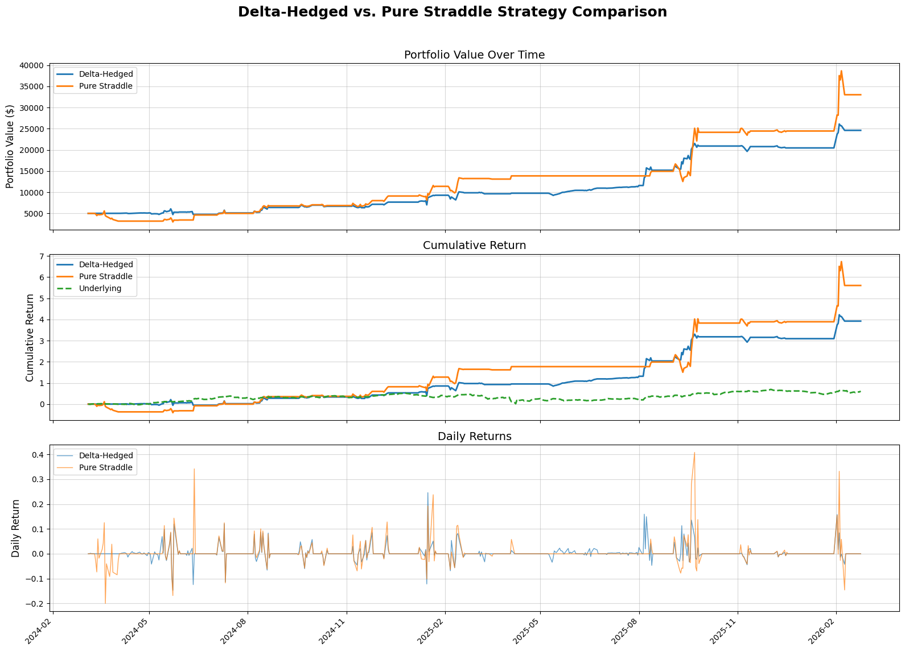
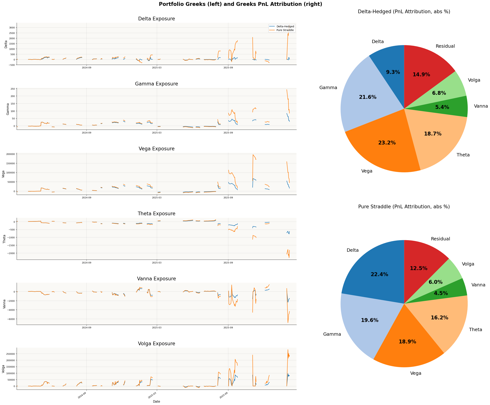
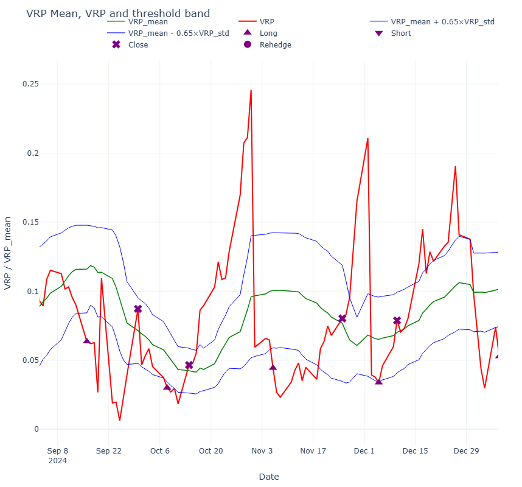

# Volatility-Based Quantitative Trading Strategy

A quantitative trading strategy that exploits the volatility risk premium (VRP) by trading straddles based on the relationship between implied volatility (IV) and realized volatility (RV). The strategy includes both delta-hedged and unhedged implementations for performance comparison.

## Overview

VRP (IV − RV) strategy: Bollinger-style bands on VRP drive **when** to go long/short straddles. Compares **delta-hedged** vs **pure straddle** (unhedged).

Example backtest results (from a typical run; actual numbers depend on data and parameters):

| Strategy | Sharpe Ratio | Annual Return | Annual Volatility |
|----------|--------------|---------------|-------------------|
| **Delta-Hedged** | ~2.46 | ~139.83% | ~55.21% |
| **Pure Straddle** | ~1.57 | ~166.72% | ~103.56% |

### Plots

<p style="text-align: center"></p>  
<p style="text-align: center"></p>

## Strategy Logic

### Bollinger Bands on VRP

VRP = IV − RV (implied minus realized volatility). We apply Bollinger-style bands to VRP so that **when** to open or close a straddle is driven by where VRP sits relative to the bands.

#### Band construction

| Item | Definition |
|------|------------|
| **VRP** | IV − RV (time series, one value per day) |
| **VRP_mean** | 20-day rolling mean of VRP |
| **VRP_std** | 20-day rolling standard deviation of VRP |
| **Band width (k)** | Entry: `vrp_threshold`; close: `vrp_close_threshold` (can differ by agent) |
| **Upper band** | VRP_mean + k × VRP_std |
| **Lower band** | VRP_mean − k × VRP_std |

So: upper = VRP_mean + k×VRP_std, lower = VRP_mean − k×VRP_std. VRP above the upper band is “expensive” volatility; below the lower band is “cheap” volatility.

#### Trading rules (VRP vs bands)

| Condition | Action |
|-----------|--------|
| VRP **above** upper band | Open **short** straddle (sell volatility) or close a **long** |
| VRP **below** lower band | Open **long** straddle (buy volatility) or close a **short** |
| VRP **between** the bands | No new entry; existing position can be closed by other rules |

#### Closing position logic

A position is closed when any of the following conditions is met. (Rehedge only adjusts the underlying hedge; it does **not** close the option.)

| Trigger | Condition | Effect |
|---------|-----------|--------|
| **VRP close (long)** | VRP moves **below** lower band (VRP &lt; VRP_mean − k×VRP_std, k = `vrp_close_threshold`) | Close long straddle; can open short on same day if VRP above upper band |
| **VRP close (short)** | VRP moves **above** upper band (VRP &gt; VRP_mean + k×VRP_std) | Close short straddle; can open long on same day if VRP below lower band |
| **Near-expiry** | Time to maturity &lt; `min_ttm`/2 (e.g. &lt; ~2 days when `min_ttm` = 4/252) | Close current option to avoid holding into expiry |
| **Monthly roll** | Roll date (e.g. first Tuesday): switch to next option cycle | Close current option; backtest may open next month’s straddle on the same or next date |

<p style="text-align: center"></p>  
*VRP (red), VRP_mean (green), bands VRP_mean ± k×VRP_std (blue). Markers: ▲ long entry, ▼ short entry, × close, ● rehedge.*

- **Long vs short sizing:** Long = pay premium, cap by `max_invest×NAV`. Short = receive premium, cap by `max_leverage×NAV`.

### Delta Hedging & Sizing

- **Delta-hedged:** Hedge at entry; rehedge by adjusting underlying only when |net_delta| &gt; threshold (PnL in balance). **Pure straddle:** no underlying.
- **Sizing:** Long = floor((max_invest×NAV) / cost_per_unit); short = −floor((max_leverage×NAV) / exposure_per_unit). Cost/exposure include premium and delta hedge terms.

## Project Structure

```
Volatility-based_Quant_Strategy/
├── Agent_Class.py              # Unhedged straddle agent (raw VRP threshold)
├── Agent_DDH_Class.py          # Delta-hedged straddle agent (VRP z-score signal, optional hedging)
├── Build_data.ipynb            # Data collection and preprocessing notebook
├── Back_test.ipynb             # Backtesting and performance analysis notebook
├── data/                       # Auxiliary data files (e.g. futures/options references)
├── DataSet/                    # Processed option and underlying data
│   ├── underlying.csv          # Historical underlying (Close, Return, RV, imp_vol, VRP, VRP_std, VRP_mean)
│   ├── call_list.pkl          # List of call option symbols
│   ├── put_list.pkl           # List of put option symbols
│   ├── dates.pkl              # Trading dates
│   ├── date_strs.pkl          # Trading dates (string format)
│   └── O_*.csv                # Individual option contract data
└── demo/                       # Visualization outputs
```

## Key Components

- **Build_data.ipynb:** Underlying (yfinance), 20d RV, first-Tuesday trade dates, ATM options (second Friday next month), Polygon option data, IV/VRP/VRP_mean/VRP_std → `DataSet/underlying.csv`, `call_list.pkl`, `put_list.pkl`, `O_*.csv`.
- **Agent_DDH** (`Agent_DDH_Class.py`): VRP bands for entry/exit; `delta_hedge=True` (hedge + rehedge by underlying only) or `False` (pure straddle). Sizing: long `max_invest×NAV`, short `max_leverage×NAV`. Exit: near-expiry, roll, VRP close (long above band, short below band).
- **Back_test.ipynb:** Runs both agents, records NAV/Greeks/events, Sharpe/CAGR/vol/drawdown, plots.

## Usage

1. Run **Build_data.ipynb** → `underlying.csv`, option lists, `O_*.csv`.
2. Run **Back_test.ipynb** → metrics and demo plots.

### Configuration

The notebook uses the following (match your run for reproducibility):

#### Delta-Hedged Agent (`Agent_DDH` with hedging)
```python
agent_ddh = Agent_DDH(
    balance=5000.0,
    max_invest=0.75,
    max_leverage=0.75,
    vrp_threshold=0.65,
    vrp_close_threshold=0.0,
    delta_rehedge_threshold=200,
)
```

#### Pure Straddle Agent
```python
agent_straddle = Agent_DDH(
    balance=5000.0,
    max_invest=0.75,
    max_leverage=0,
    vrp_threshold=0.0,
    vrp_close_threshold=0.35,
    delta_hedge=False,
)
```

## Metrics & Data

- **Metrics:** Final NAV, total return, Sharpe (CAGR-based), annual vol, max drawdown.
- **Dependencies:** pandas, numpy, scipy, matplotlib, yfinance, polygon-api-client.
- **Data:** `underlying.csv` needs Date, Close, Return, RV, imp_vol, VRP, VRP_std, VRP_mean. Options in `O_*.csv`; lists in `call_list.pkl`, `put_list.pkl`; dates in `dates.pkl`, `date_strs.pkl`. Trade schedule: first Tuesday; options ATM, expire second Friday next month.

